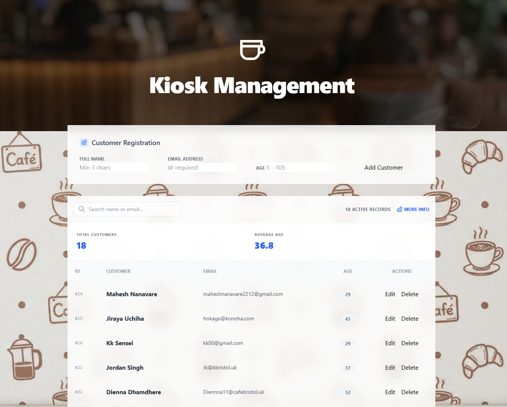

# Bristol Kiosk Management System

A cloud-deployed full-stack CRUD application developed for the Kurve Programming Task. This system manages customer records using a Java/Spring Boot backend and JavaScript frontend.

## Live Production Environment
The application is fully deployed and accessible via Render:
https://cafe-service-dqh6.onrender.com/

I chose to host both the application and the PostgreSQL database in the cloud to ensure the system is accessible from any device, rather than just running on a local computer.

### Dashboard Overview

*The main dashboard interface featuring a customer registration bar, an expandable information section, and a dynamic customer data table with real-time search filtering.*

## Tech Stack
- Backend: Java 17, Spring Boot, Spring Data JPA
- Frontend: HTML5, Tailwind CSS, JavaScript (Fetch API)
- Database: Managed PostgreSQL (Render)
- Hosting: Render Cloud Platform

## Core Features
- Full CRUD: Create, Read, Update, and Delete customers.
- Instant Search: Fast filtering logic to find customers by name or email without reloading.
- Responsive Design: Layout works on kiosks, tablets, and desktop screens.
- Asynchronous Operations: Uses Fetch API so the page never has to refresh.

## Discussion and Reflection

### What parts of the stack were familiar to you?
I was already comfortable using Java and the Spring Boot framework for backend logic. I also had previous experience using Tailwind CSS and JavaScript from my MSc projects. Additionally, I completed an online course on PostgreSQL a few years ago. While I did not need to write manual SQL queries due to the object mapping provided by JPA and Hibernate, my background in PostgreSQL was useful for verifying the queries Hibernate generated each time the URL sent a request to the database.

### What was new?
I tried using MySQL Workbench for the first time, but then I realized that Render has built-in support for PostgreSQL. Then I had to install pgAdmin to manage my database locally instead. Learning how to create and connect a live database service in Render was a very useful experience that I will definitely use in future projects.

### What did I learn while doing this project?
I learned that making logical improvements in the code doesn't always show up immediately on the live site unless the deployment is handled correctly. Most importantly, I learned the value of using development branches. Being able to test new features in a separate branch on Render allowed me to experiment without worrying about breaking the version of the application that was already working.

## Local Development Setup
1. Clone the repository to your local machine.
2. Ensure Java 17 and Maven are installed.
3. Configure your local PostgreSQL credentials in `src/main/resources/application.properties`.
4. Run the application using the command: `./mvnw spring-boot:run`
5. Open `http://localhost:8080` in your web browser.